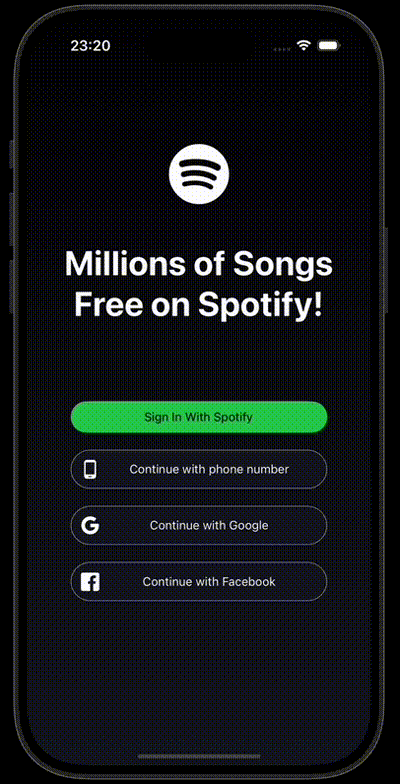

<h1>Spotify Clone</h1>

This project, created using the Context API, is a Spotify-like app that covers essential Spotify functionalities such as music playback, user session management, and song search. The technologies and libraries used add specific functionality to the project:

- **React Native and React**: Provide the fundamental structure of the app, offering native performance on mobile devices.
- **@react-navigation**: Enables navigation between pages.
- **Axios**: Used for retrieving song data and making other API requests.
- **react-native-track-player**: Enables music playback functionality.
- **@react-native-async-storage**: Used for storing user session data and favorite songs on the device.
- **react-native-linear-gradient and react-native-vector-icons**: Provide stylish and customized UI elements with color gradients and icons.

This setup improves user experience while making the app more interactive and functional.

